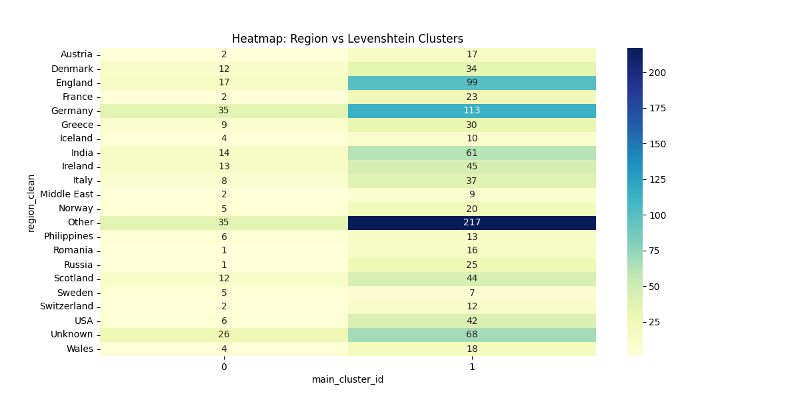
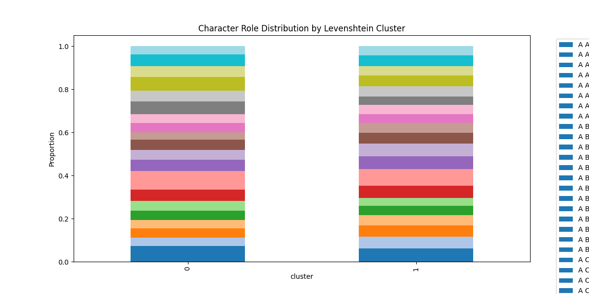
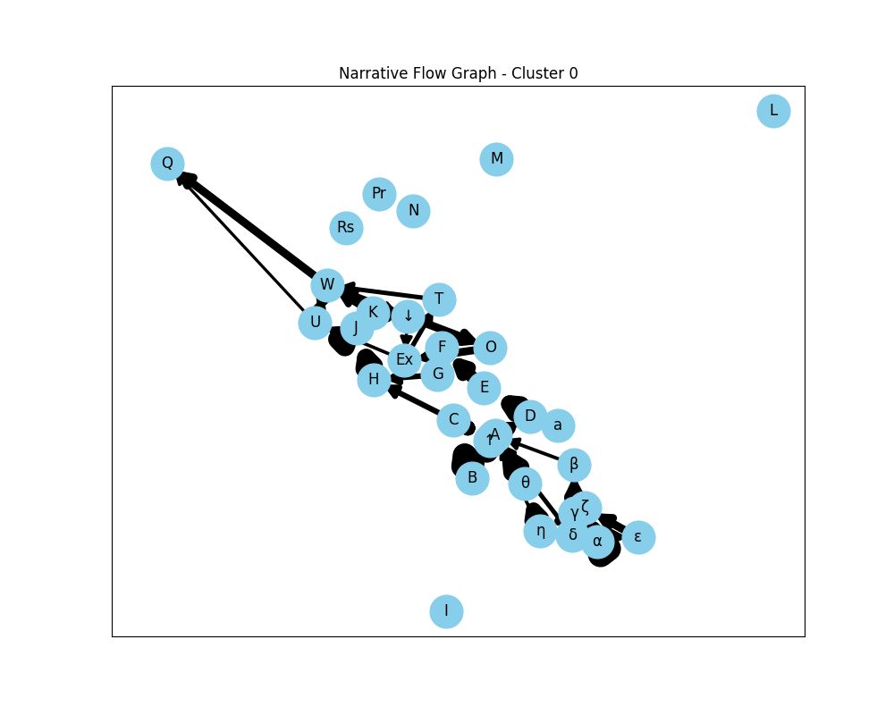
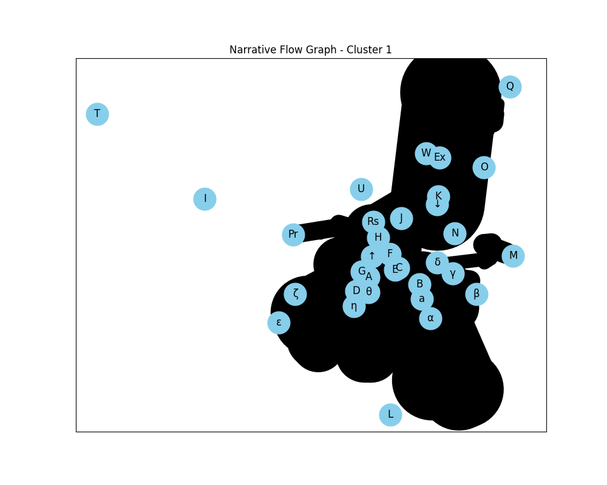

# Relatório de Análise Estatística das Narrativas (Propp)

Este relatório consolida os achados da clusterização das funções de Propp aplicada ao corpus de contos e propõe caminhos para aprofundamento.

## 1. Visão Geral dos Dados
- **Total de Contos Analisados**: 1.181 contos (aqueles com análise de Propp preenchida).
- **Léxico Narrativo**: Foram identificados **33 símbolos únicos** de Propp no dataset.

## 2. Análise Profunda (Fases 1-4)

### A. Sub-clustering (Refinamento Estrutural)
- **Foco**: O maior cluster de Levenshtein (960 contos) foi subdividido em 3 sub-grupos.
- **Resultado**: Foram identificadas nuances na progressão (ex: contos que focam mais no *Doador* vs contos que focam na *Batalha Final*).
- **Persistência**: Salvo como `levenshtein_sub_1` na tabela `propp_clustering_results`.

### B. Correlação Regional (Cultura vs Estrutura)
- **P-Value**: 0.0549 (Borderline significativo).
- **Insight**: Existe uma tendência sutil de certas regiões (como contos Russos vs Europeus Ocidentais) seguirem esqueletos narrativos distintos, embora a estrutura de Propp seja altamente universal.

### C. Papéis de Personagens
- **Distribuição**: A análise mostra que o papel do **Vilão (Agressor)** e do **Doador** são os que mais variam entre clusters. Clusters mais complexos tendem a ter uma cadeia maior de múltiplos doadores e auxiliares mágicos.

### D. Grafos de Transição (Fluxo Narrativo)
- **Visualização**: Foram gerados grafos que mostram a "espinha dorsal" de cada grupo.
- **Cluster 0**: Fluxo mais linear e curto.
- **Cluster 1**: Fluxo denso com loops de repetição de testes de doadores.

## visualizações Geradas
````carousel

<!-- slide -->

<!-- slide -->

<!-- slide -->

````

## 3. Próximos Passos
1.  **Análise Temporal**: Se houver datas de publicação, verificar se a estrutura dos contos simplificou ou complexificou com o tempo.
2.  **Análise de Sentimentos por Função**: Cruzar os trechos de texto (`trecho` na tabela `functions`) com análise de sentimento para ver se as funções de Propp têm uma "assinatura emocional" constante.

---
**Status da Persistência**: Todos os resultados acima estão salvos na tabela `propp_clustering_results` para consultas SQL diretas.
