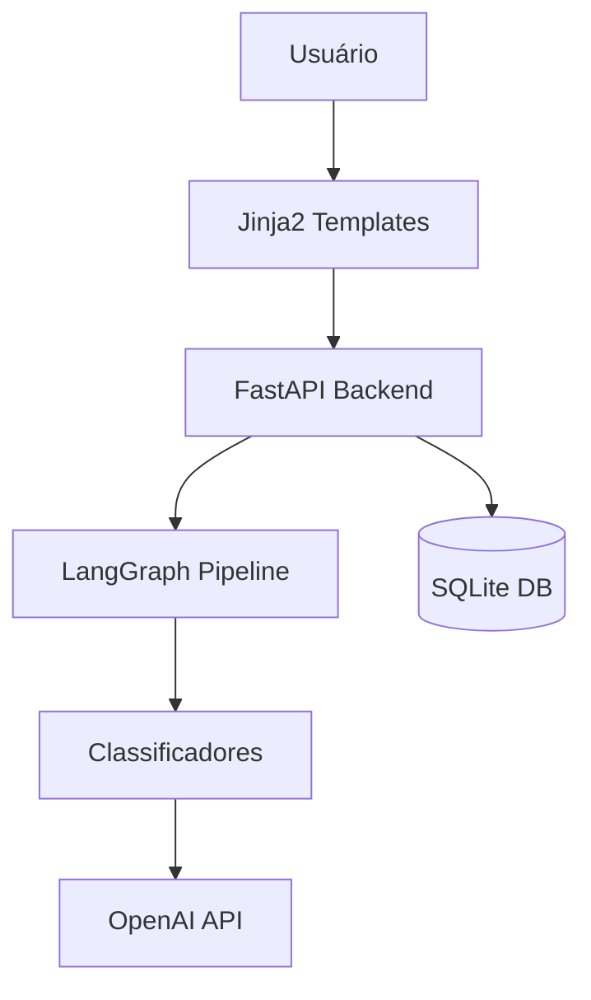

# Plano de Implementação Técnica

## Arquitetura Geral



## Stack Técnica (Decidida)

### Backend
- **Framework**: FastAPI com Uvicorn
- **Linguagem**: Python 3.13
- **Gerenciamento de pacotes**: uv
- **Configuração**: Pydantic Settings

### Frontend
- **Template Engine**: Jinja2 (server-side rendering)
- **CSS**: Vanilla CSS com foco em estética premium
- **JavaScript**: Vanilla JS (mínimo necessário)

### AI/Classificação
- **Orquestração**: LangGraph para pipeline de classificação
- **LLM**: OpenAI (via langchain-openai)
- **Classificadores existentes**:
  - Personagens de Propp (`xer/classification/personagens_propp.py`)
  - Estrutura narrativa de Propp (`xer/classification/estrut_narrativa_propp.py`)
  - Booker 7 Plots (`xer/classification/booker_7_plots.py`)

### Dados
- **Banco de Dados**: SQLite (`data/xer.db`)
- **Schema**:
  - Tabela `tales`: id, title, text, source, metadata
  - Tabela `classifications`: id, tale_id, tipo_classificacao, codigo_classificacao, descricao

## Estrutura de Diretórios

```
xer/
├── main.py                 # Entry point FastAPI
├── xer/
│   ├── api/                # Rotas FastAPI (v1/)
│   │   ├── tales.py        # Endpoints de contos
│   │   └── search.py       # Endpoints de busca
│   ├── classification/     # Classificadores LangGraph
│   ├── config.py           # Pydantic Settings
│   ├── database.py         # Conexão e queries SQLite
│   ├── logger.py           # Logger configurado
│   └── templates/          # Jinja2 templates
│       ├── base.html       # Template base
│       ├── index.html      # Página inicial
│       ├── tale.html       # Visualização de conto
│       └── search.html     # Resultados de busca
├── static/                 # CSS, JS, imagens
│   ├── css/
│   │   └── main.css        # Estilos principais
│   └── js/
│       └── main.js         # Scripts mínimos
└── tests/                  # Pytest tests
```

## Componentes Principais

### 1. FastAPI Routes (`xer/api/`)
- `GET /` - Página inicial
- `GET /tales/{id}` - Visualizar conto
- `GET /search` - Busca (GET params: q, classification, etc.)
- `GET /api/v1/tales` - API JSON para listagem
- `GET /api/v1/tales/{id}` - API JSON para conto específico

### 2. Database Module (`xer/database.py`)
- Funções de consulta (get_tale, search_tales, list_classifications)
- Connection pooling para SQLite

### 3. Templates (`xer/templates/`)
- Sistema de templates com herança (base.html)
- Componentes reutilizáveis (ex: card de conto)

### 4. Static Assets (`static/`)
- CSS com design system (cores, tipografia, espaçamento)
- CSS responsivo (mobile-first)

## Decisões Arquiteturais

### Por que SQLite?
- Suficiente para MVP
- Zero config em deploy
- Fácil migração futura para PostgreSQL se necessário

### Por que Jinja2?
- SEO nativo (conteúdo renderizado no servidor)
- Simplicidade (sem build tools complexos)
- Performance superior para conteúdo estático

### Por que não SPA?
- Conteúdo precisa ser indexado (SEO crítico)
- Evita complexidade desnecessária no MVP
- Progressive enhancement: podemos adicionar interatividade depois

## Fluxo de Dados

1. **Usuário acessa página** → FastAPI renderiza template Jinja2
2. **Busca de contos** → Query no SQLite → Renderiza resultados
3. **Leitura de conto** → Fetch do DB → Renderiza com metadados/classificações

## Performance Targets
- **Time to First Byte (TTFB)**: < 200ms
- **Largest Contentful Paint (LCP)**: < 2.5s
- **Cumulative Layout Shift (CLS)**: < 0.1

## Observabilidade
- Logs estruturados (já configurado em `xer/logger.py`)
- LangSmith tracing para debugging de classificadores (opcional)
